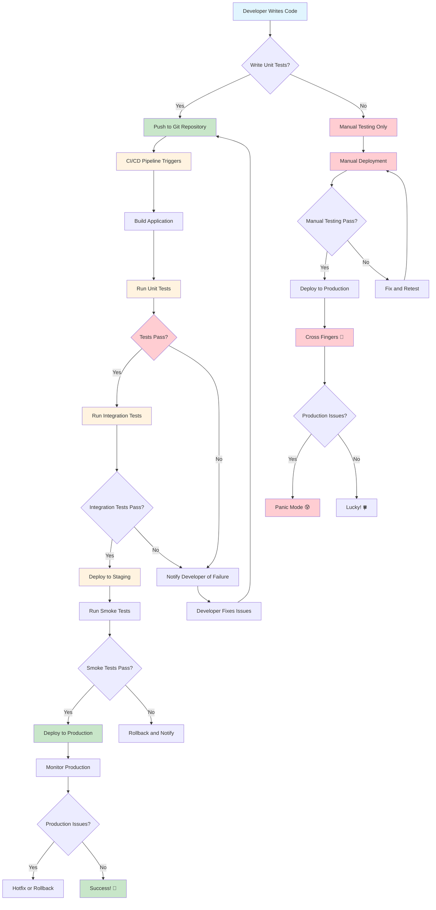
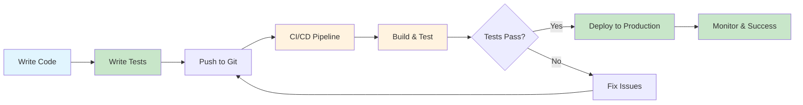
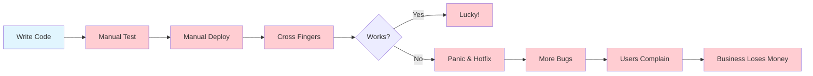
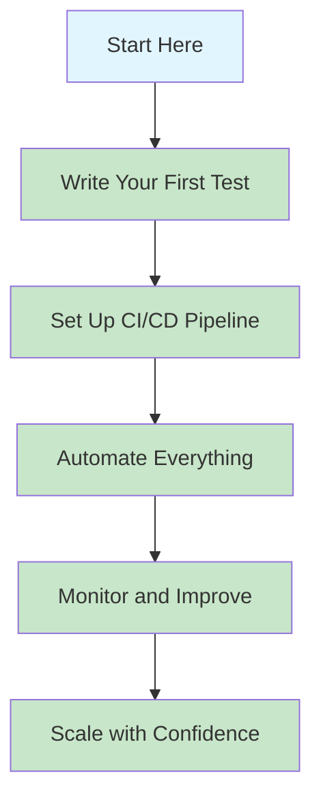

# Section 13: Controller Testing

Welcome to the testing phase! In this section, we'll create comprehensive unit tests for all our controller functions. Testing is crucial for ensuring our API endpoints work correctly and handle edge cases properly.

---

## 🎯 Step 0: Why We Need Unit Tests and CI/CD

Before we dive into writing tests, let's understand **why** testing and CI/CD are essential for professional software development.

### **🤔 What Happens Without Unit Tests and CI/CD?**

#### **❌ The Nightmare Scenario:**
```bash
# Developer workflow WITHOUT testing:
1. Write code quickly
2. Test manually with Swagger (sometimes)
3. Deploy to production
4. Users find bugs
5. Hotfix in production
6. More bugs introduced
7. Users complain
8. Business loses money
9. Developer loses sleep 😰
```

#### **🚨 Real-World Problems Without Testing:**
```bash
# Common scenarios in untested applications:

❌ "It works on my machine" syndrome
❌ Production crashes from simple bugs
❌ Manual testing takes hours
❌ Deployments break existing features
❌ No confidence in code changes
❌ Difficult to add new features
❌ Hard to refactor safely
❌ Team members afraid to change code
❌ Business loses trust in development team
```

### **✅ What Happens WITH Unit Tests and CI/CD?**

#### **🎯 The Professional Scenario:**
```bash
# Developer workflow WITH testing:
1. Write code with confidence
2. Write comprehensive unit tests
3. Push to Git repository
4. CI/CD automatically:
   - Builds the application
   - Runs all tests
   - Deploys if tests pass
   - Notifies of success/failure
5. Users get stable, tested code
6. Developer sleeps peacefully 😴
```

#### **🏆 Benefits of Proper Testing:**
```bash
✅ Catch bugs before they reach users
✅ Automated quality assurance
✅ Fast feedback on code changes
✅ Safe refactoring and updates
✅ Confidence in deployments
✅ Reduced manual testing time
✅ Better code documentation
✅ Team collaboration safety
```

---

### **📊 Unit Tests vs Manual Testing Comparison:**

| Aspect | Manual Testing (Swagger) | Unit Tests + CI/CD |
|--------|-------------------------|-------------------|
| **Speed** | Slow (manual process) | Fast (automated) |
| **Reliability** | Error-prone (human mistakes) | Consistent (automated) |
| **Coverage** | Limited (what you remember to test) | Comprehensive (all code paths) |
| **Repeatability** | Inconsistent | Always the same |
| **Scalability** | Doesn't scale with team size | Scales perfectly |
| **Cost** | Expensive (developer time) | Cheap (automated) |
| **Confidence** | Low (did I test everything?) | High (automated verification) |

---

### **🎯 Pros and Cons Analysis:**

#### **✅ Pros of Unit Tests + CI/CD:**

**For Developers:**
```bash
✅ Write code with confidence
✅ Fast feedback on changes
✅ Safe refactoring
✅ Clear documentation of expected behavior
✅ Reduced debugging time
✅ Better code design (testable code is better code)
```

**For Business:**
```bash
✅ Fewer production bugs
✅ Faster feature delivery
✅ Reduced maintenance costs
✅ Higher user satisfaction
✅ Better team productivity
✅ Lower risk of critical failures
```

**For Users:**
```bash
✅ More stable applications
✅ Fewer crashes and bugs
✅ Better user experience
✅ Reliable features
✅ Faster bug fixes
```

#### **❌ Cons of Unit Tests + CI/CD:**

**Initial Investment:**
```bash
❌ Time to write tests (initially slower)
❌ Learning curve for testing frameworks
❌ Setup time for CI/CD pipelines
❌ Infrastructure costs for CI/CD
```

**Maintenance:**
```bash
❌ Tests need to be maintained
❌ CI/CD pipelines need updates
❌ Additional complexity in development process
```

**However, these "cons" are actually investments that pay off quickly!**

---

### **🚨 Real-World Examples:**

#### **Example 1: E-Bookstore Without Testing**
```csharp
// Developer adds a new feature
public async Task<IActionResult> CreateBook(CreateBookDto dto)
{
    // Quick implementation without testing
    var book = new Book { Title = dto.Title, Price = dto.Price };
    _context.Books.Add(book);
    await _context.SaveChangesAsync();
    return Ok(book);
}

// Problems that arise:
❌ No validation of input data
❌ No error handling for database failures
❌ No testing of edge cases
❌ Deployed to production
❌ Users start getting errors
❌ Database gets corrupted
❌ Business loses money
```

#### **Example 2: E-Bookstore With Testing**
```csharp
// Same feature with proper testing
public async Task<IActionResult> CreateBook(CreateBookDto dto)
{
    if (!ModelState.IsValid)
        return BadRequest(ModelState);
    
    try
    {
        var book = new Book { Title = dto.Title, Price = dto.Price };
        _context.Books.Add(book);
        await _context.SaveChangesAsync();
        return CreatedAtAction(nameof(GetBook), new { id = book.Id }, book);
    }
    catch (Exception ex)
    {
        return StatusCode(500, new { message = "Error creating book" });
    }
}

// Benefits:
✅ Input validation tested
✅ Error handling tested
✅ Edge cases covered
✅ Deployed with confidence
✅ Users get stable experience
✅ Business runs smoothly
```

---

### **🎯 The Cost-Benefit Analysis:**

#### **Short-term (First 2-4 weeks):**
```bash
❌ Slower development (writing tests)
❌ Learning curve
❌ Setup time
```

#### **Long-term (After 1 month):**
```bash
✅ 10x faster development
✅ Fewer bugs in production
✅ Confident deployments
✅ Happy users
✅ Happy business
✅ Happy developers
```

---

### **🏆 Best Practices for Testing:**

#### **What to Test:**
```bash
✅ All controller endpoints
✅ Success scenarios
✅ Error scenarios
✅ Edge cases
✅ Validation failures
✅ Authorization scenarios
✅ Database errors
✅ Network failures
```

#### **What NOT to Test:**
```bash
❌ Third-party libraries (they have their own tests)
❌ Framework code (ASP.NET Core is already tested)
❌ Trivial code (getters/setters)
❌ External APIs (mock them)
```

---

### **🚀 Getting Started with Testing:**

#### **The Testing Mindset:**
```bash
# Instead of: "I hope this works"
# Think: "I know this works because I tested it"

# Instead of: "Let me test this manually"
# Think: "Let me write a test for this"

# Instead of: "I'm afraid to change this code"
# Think: "I can change this safely because I have tests"
```

#### **The CI/CD Mindset:**
```bash
# Instead of: "I'll deploy when I have time"
# Think: "Every code push automatically deploys if tests pass"

# Instead of: "I hope the deployment works"
# Think: "I know the deployment works because tests passed"
```

---

**Now that you understand WHY testing is crucial, let's learn HOW to implement it properly!** 🎯

---

### **🔄 Testing and CI/CD Flow Chart:**



### **📊 Flow Chart Explanation:**

#### **🟢 Professional Path (With Testing):**
```bash
✅ Developer writes code
✅ Writes comprehensive unit tests
✅ Pushes to Git
✅ CI/CD automatically builds and tests
✅ Only deploys if tests pass
✅ Monitors production
✅ Success with confidence! 🎉
```

#### **🔴 Risky Path (Without Testing):**
```bash
❌ Developer writes code
❌ Manual testing only (sometimes)
❌ Manual deployment
❌ Cross fingers and hope
❌ Production issues likely
❌ Panic mode when bugs appear 😰
```

---

### **🎯 Detailed Workflow Comparison:**

#### **🟢 With Unit Tests + CI/CD:**


#### **🔴 Without Unit Tests + CI/CD:**


---

### **📈 Success Metrics Comparison:**

#### **🟢 With Testing + CI/CD:**
```bash
✅ 95%+ test coverage
✅ Automated deployments
✅ < 5 minutes deployment time
✅ Zero-downtime deployments
✅ Automatic rollback capability
✅ Real-time monitoring
✅ Proactive issue detection
✅ High team confidence
✅ Happy users
✅ Profitable business
```

#### **🔴 Without Testing + CI/CD:**
```bash
❌ 0% test coverage
❌ Manual deployments
❌ 2+ hours deployment time
❌ Downtime during deployments
❌ Manual rollback process
❌ Reactive issue detection
❌ Low team confidence
❌ Unhappy users
❌ Business losses
```

---

### **🎯 Decision Points in the Flow:**

#### **🟢 Professional Decision Points:**
```bash
✅ Write tests for new features
✅ Run tests before committing
✅ Review test coverage
✅ Monitor CI/CD pipeline
✅ Act on test failures immediately
✅ Deploy with confidence
```

#### **🔴 Risky Decision Points:**
```bash
❌ Skip testing to save time
❌ Deploy without testing
❌ Ignore test failures
❌ Manual deployment process
❌ Hope for the best
❌ React to production issues
```

---

### **🚀 The Path to Success:**



**Choose the professional path - your future self will thank you!** 🎯

---

## 🎯 What You'll Learn

- How to create unit tests for ASP.NET Core controllers
- How to mock services and dependencies
- How to test different HTTP status codes and responses
- How to test validation and error handling
- How to use xUnit and Moq for testing
- How to test async controller methods

---

## 🏗️ Step 1: Set Up Testing Project

### **Test Project Structure:**
```
Solution Explorer:
├── OnlineBookstore.Server/
├── OnlineBookstore.client    
├── OnlineBookstore.Server.Tests/
    ├── Controllers/
    │   ├── AuthorsControllerTests.cs
    │   ├── BooksControllerTests.cs
    │   ├── CategoriesControllerTests.cs
    │   ├── OrdersControllerTests.cs
    │   ├── ReviewsControllerTests.cs
    │   └── ShoppingCartControllerTests.cs
    ├── Helpers/
    │   └── TestHelpers.cs
    └── EbooksPlatfor.Server.Tests.csproj
```

### **🎯 How to Create Test Project in Visual Studio:**

#### **Method 1: Using Visual Studio GUI (Recommended)**
```bash
1. Right-click on solution in Solution Explorer
2. Select "Add" → "New Project"
3. Search for "xunit" in the search box
4. Select "xUnit Test Project" (.NET Core)
5. Click "Next"
6. Project name: "EbooksPlatfor.Server.Tests"
7. Location: Same folder as your main project
8. Click "Create"
```

#### **Method 2: Using Package Manager Console**
```powershell
# Navigate to your solution directory
cd "C:\Users\YIPING YUAN\source\repos\EbooksPlatfor"

# Create test project
dotnet new xunit -n EbooksPlatfor.Server.Tests

# Add to solution
dotnet sln add EbooksPlatfor.Server.Tests/EbooksPlatfor.Server.Tests.csproj

# Add reference to main project
dotnet add EbooksPlatfor.Server.Tests/EbooksPlatfor.Server.Tests.csproj reference EbooksPlatfor.Server/EbooksPlatfor.Server.csproj
```

#### **Method 3: Using Command Line**
```bash
# Navigate to your solution directory
cd "C:\Users\YIPING YUAN\source\repos\EbooksPlatfor"

# Create test project
dotnet new xunit -n EbooksPlatfor.Server.Tests

# Add to solution
dotnet sln add EbooksPlatfor.Server.Tests/EbooksPlatfor.Server.Tests.csproj

# Add reference to main project
dotnet add EbooksPlatfor.Server.Tests/EbooksPlatfor.Server.Tests.csproj reference EbooksPlatfor.Server/EbooksPlatfor.Server.csproj
```

### **📋 After Creating Test Project:**

#### **Step 1: Add Required NuGet Packages**
```powershell
# In Package Manager Console:
Install-Package Moq -ProjectName EbooksPlatfor.Server.Tests
Install-Package FluentAssertions -ProjectName EbooksPlatfor.Server.Tests
Install-Package Microsoft.AspNetCore.Mvc.Testing -ProjectName EbooksPlatfor.Server.Tests
```

#### **Step 2: Create Folder Structure**
```
Right-click on test project → Add → New Folder:
├── Controllers/          # For controller tests
├── Services/            # For service tests
└── Helpers/            # For test helpers
```

#### **Step 3: Delete Default Test File**
```
Delete UnitTest1.cs (the default test file)
```

#### **Step 4: Add Project Reference**
```bash
1. Right-click on "OnlineBookstore.Server.Tests" in Solution Explorer
2. Select "Add" → "Project Reference"
3. Check the box next to "OnlineBookstore.Server"
4. Click "OK"
```

**📋 Alternative Methods:**
```powershell
# Using Package Manager Console:
dotnet add OnlineBookstore.Server.Tests/OnlineBookstore.Server.Tests.csproj reference OnlineBookstore.Server/OnlineBookstore.Server.csproj

# Using Command Line:
cd "C:\Users\YIPING YUAN\source\repos\EbooksPlatfor"
dotnet add OnlineBookstore.Server.Tests/OnlineBookstore.Server.Tests.csproj reference OnlineBookstore.Server/OnlineBookstore.Server.csproj
```

#### **Step 5: Fix Namespace Issues**
```bash
# Common error: "The type or namespace name 'Models' does not exist"
# Solution: Add project reference (Step 4 above)

# Update using statements in test files:
using OnlineBookstore.Models;     // For Author, Book, etc.
using OnlineBookstore.DTOs;      // For AuthorDto, CreateAuthorDto, etc.
using OnlineBookstore.Services;   // For IAuthorService, etc.
using OnlineBookstore.Server.Tests.Helpers;  // For TestHelpers
```

---

## 🎯 **Understanding Dependency Injection vs Mocking**

### **🤔 Why Manual Object Creation in Tests?**

Many developers wonder why we manually create objects in tests instead of using dependency injection. Here's the explanation:

### **🏭 Production Code (Real Dependency Injection):**
```csharp
// Program.cs - Real DI Container
builder.Services.AddScoped<IAuthorService, AuthorService>();

// AuthorsController.cs - Real DI
public class AuthorsController : ControllerBase
{
    private readonly IAuthorService _authorService;

    public AuthorsController(IAuthorService authorService) // ← Real DI
    {
        _authorService = authorService; // ← Real service injected
    }

    public async Task<IActionResult> GetAuthors()
    {
        var authors = await _authorService.GetAllAuthorsAsync(); // ← Real database call
        return Ok(authors);
    }
}
```

### **🧪 Unit Tests (Mocking):**
```csharp
// AuthorsControllerTests.cs - Mock objects
public class AuthorsControllerTests
{
    private readonly Mock<IAuthorService> _mockAuthorService;
    private readonly AuthorsController _controller;

    public AuthorsControllerTests()
    {
        _mockAuthorService = new Mock<IAuthorService>(); // ← Mock, not real service
        _controller = new AuthorsController(_mockAuthorService.Object); // ← Manual creation
    }

    [Fact]
    public async Task GetAuthors_ReturnsOkResult_WithAuthorsList()
    {
        // Arrange
        var authors = new List<AuthorDto> { /* test data */ };
        _mockAuthorService.Setup(x => x.GetAllAuthorsAsync())
            .ReturnsAsync(authors); // ← Mock behavior, no database

        // Act
        var result = await _controller.GetAuthors();

        // Assert
        result.Result.Should().BeOfType<OkObjectResult>();
    }
}
```

### **📊 Comparison Table:**

| Aspect | Production (DI) | Unit Tests (Mocking) |
|--------|-----------------|---------------------|
| **Service Creation** | DI Container creates real services | Manual creation with mocks |
| **Database** | Real database connections | No database (mocked) |
| **Speed** | Normal performance | Very fast |
| **Dependencies** | Real external dependencies | Isolated (no external deps) |
| **Reliability** | Can fail due to network/DB | Always reliable |
| **Test Data** | Real data from database | Controlled test data |
| **Scenarios** | Limited to real data | Any scenario possible |

### **✅ Benefits of Mocking in Tests:**

#### **🚀 Performance:**
```bash
✅ Tests run in milliseconds (no database)
✅ No network calls or external API calls
✅ No file system operations
✅ No database queries
```

#### **🔒 Isolation:**
```bash
✅ Tests don't depend on external systems
✅ Tests don't affect real data
✅ Tests can run in any environment
✅ Tests are independent of each other
```

#### **🎯 Control:**
```bash
✅ Can simulate any scenario (success, failure, errors)
✅ Can test edge cases easily
✅ Can test error handling
✅ Can test specific conditions
```

#### **🔄 Repeatability:**
```bash
✅ Same results every time
✅ No flaky tests due to external factors
✅ Tests are deterministic
✅ Can run tests in any order
```

### **❌ Problems with Real DI in Tests:**

#### **🐌 Performance Issues:**
```bash
❌ Tests would be slow (database calls)
❌ Tests would depend on network
❌ Tests would have real startup time
❌ Tests would use real resources
```

#### **🔗 Dependency Issues:**
```bash
❌ Tests would need real database
❌ Tests would need real external APIs
❌ Tests would fail if services are down
❌ Tests would be integration tests, not unit tests
```

#### **🎲 Reliability Issues:**
```bash
❌ Tests could fail due to network issues
❌ Tests could fail due to database issues
❌ Tests could fail due to external API changes
❌ Tests would be flaky and unreliable
```

### **🎯 Key Differences Summary:**

#### **🏭 Production (DI Container):**
```csharp
// Real service implementation
var controller = serviceProvider.GetService<AuthorsController>();
// ↑ Real AuthorService with real database calls
```

#### **🧪 Unit Tests (Manual Mocking):**
```csharp
// Mock service implementation
var mockService = new Mock<IAuthorService>();
var controller = new AuthorsController(mockService.Object);
// ↑ Mock AuthorService with controlled test data
```

### **📋 Best Practices:**

#### **✅ Use DI in Production:**
```bash
✅ Let DI container manage real services
✅ Use real implementations
✅ Handle real dependencies
✅ Optimize for production performance
```

#### **✅ Use Mocking in Tests:**
```bash
✅ Manually create test objects
✅ Use mocks for dependencies
✅ Control test scenarios
✅ Focus on unit testing logic
```

### **🎯 Why This Matters:**

#### **🏆 Professional Testing:**
```bash
✅ Fast, reliable unit tests
✅ Isolated test environment
✅ Comprehensive test coverage
✅ Easy to maintain and debug
✅ Professional development practices
```

**Understanding this difference is crucial for writing effective unit tests that are fast, reliable, and maintainable!** 🎯

### **📋 Test Project File Content:**

#### **EbooksPlatfor.Server.Tests.csproj:**
```xml
<Project Sdk="Microsoft.NET.Sdk">

  <PropertyGroup>
    <TargetFramework>net8.0</TargetFramework>
    <ImplicitUsings>enable</ImplicitUsings>
    <Nullable>enable</Nullable>
    <IsPackable>false</IsPackable>
    <IsTestProject>true</IsTestProject>
  </PropertyGroup>

  <ItemGroup>
    <PackageReference Include="Microsoft.NET.Test.Sdk" Version="17.8.0" />
    <PackageReference Include="xunit" Version="2.6.6" />
    <PackageReference Include="xunit.runner.visualstudio" Version="2.5.6" />
    <PackageReference Include="Moq" Version="4.20.70" />
    <PackageReference Include="Microsoft.AspNetCore.Mvc.Testing" Version="8.0.0" />
    <PackageReference Include="FluentAssertions" Version="6.12.0" />
  </ItemGroup>

  <ItemGroup>
    <ProjectReference Include="..\EbooksPlatfor.Server\EbooksPlatfor.Server.csproj" />
  </ItemGroup>

</Project>
```

### **📋 How to Modify the .csproj File:**

#### **Method 1: Edit Project File (Recommended)**
```bash
1. Right-click on "OnlineBookstore.Server.Tests" in Solution Explorer
2. Select "Edit Project File"
3. The .csproj file will open in the editor
4. Make your changes
5. Save the file (Ctrl+S)
```
### **🎯 Common .csproj Modifications:**

#### **📦 Add New NuGet Packages:**
```xml
<PackageReference Include="NewPackage" Version="1.0.0" />
```

#### **🔧 Change Target Framework:**
```xml
<TargetFramework>net8.0</TargetFramework>
```

#### **📁 Add Project References:**
```xml
<ProjectReference Include="..\OtherProject\OtherProject.csproj" />
```

#### **⚙️ Add Custom Build Settings:**
```xml
<PropertyGroup>
    <IsPackable>false</IsPackable>
    <IsTestProject>true</IsTestProject>
</PropertyGroup>
```

### **✅ Verification Steps:**

#### **Step 1: Build the Solution**
```bash
# Build the entire solution
dotnet build
# Or in Visual Studio: Ctrl+Shift+B
```

#### **Step 2: Run a Simple Test**
```csharp
// Create a simple test in Controllers/AuthorsControllerTests.cs
[Fact]
public void SimpleTest_ShouldPass()
{
    // Arrange
    var expected = true;
    
    // Act
    var actual = true;
    
    // Assert
    Assert.Equal(expected, actual);
}
```

#### **Step 3: Run Tests**
```bash
# Run all tests
dotnet test

# Or in Visual Studio: Test → Test Explorer → Run All
```

### **📁 See individual test files for detailed implementation:**
- **13.1-AUTHORS-CONTROLLER-TESTS.md** - Authors Controller tests
- **13.2-BOOKS-CONTROLLER-TESTS.md** - Books Controller tests  
- **13.3-REVIEWS-CONTROLLER-TESTS.md** - Reviews Controller tests
- **13.4-SHOPPING-CART-ORDERS-TESTS.md** - Shopping Cart and Orders tests

---

## 🧪 Step 2: Create Test Helpers

**📁 See individual test files for detailed TestHelpers implementation:**
- **13.1-AUTHORS-CONTROLLER-TESTS.md** - Author test helpers
- **13.2-BOOKS-CONTROLLER-TESTS.md** - Book test helpers  
- **13.3-REVIEWS-CONTROLLER-TESTS.md** - Review test helpers
- **13.4-SHOPPING-CART-ORDERS-TESTS.md** - Cart and Order test helpers

---

## 🧪 Step 3: Test Authors Controller

**📁 See 13.1-AUTHORS-CONTROLLER-TESTS.md for complete implementation**

---

## 🧪 Step 4: Test Books Controller

**📁 See 13.2-BOOKS-CONTROLLER-TESTS.md for complete implementation**

---

## 🧪 Step 5: Test Reviews Controller

**📁 See 13.3-REVIEWS-CONTROLLER-TESTS.md for complete implementation**

---

## 🧪 Step 6: Test Shopping Cart Controller

**📁 See 13.4-SHOPPING-CART-ORDERS-TESTS.md for complete implementation**

---

## 🧪 Step 7: Test Orders Controller

**📁 See 13.4-SHOPPING-CART-ORDERS-TESTS.md for complete implementation**

---

## 🧪 Step 8: Run Tests

### **Add Test Project to Solution:**
```bash
# Add test project to solution
dotnet sln add EbooksPlatfor.Server.Tests/EbooksPlatfor.Server.Tests.csproj
```

### **Run All Tests:**
```bash
# Run all tests
dotnet test

# Run tests with verbose output
dotnet test --verbosity normal

# Run specific test class
dotnet test --filter "FullyQualifiedName~AuthorsControllerTests"

# Run tests with coverage
dotnet test --collect:"XPlat Code Coverage"
```

---

## 🏆 Best Practices

### **Testing Best Practices:**
- **Arrange-Act-Assert** pattern for clear test structure
- **Mock external dependencies** to isolate unit tests
- **Test both success and failure scenarios**
- **Use descriptive test names** that explain the scenario
- **Test edge cases and error conditions**
- **Keep tests independent** of each other

### **Controller Testing Best Practices:**
- **Test all HTTP status codes** (200, 201, 400, 401, 404, 500)
- **Test model validation** errors
- **Test authorization** scenarios
- **Test exception handling**
- **Mock service dependencies** completely
- **Test async methods** properly

### **Test Organization Best Practices:**
- **Group related tests** in test classes
- **Use consistent naming** conventions
- **Create reusable test helpers**
- **Test one scenario per test method**
- **Use meaningful test data**

---

## ✅ What You've Accomplished

- ✅ Created **comprehensive test suite** for all controllers
- ✅ **Implemented unit tests** for CRUD operations
- ✅ **Added error handling tests** for edge cases
- ✅ **Created test helpers** for reusable test data
- ✅ **Tested authorization scenarios** (user permissions)
- ✅ **Added validation tests** for input data
- ✅ **Implemented async testing** patterns
- ✅ **Created mock service patterns** for isolation

---

## 🚀 Next Steps

Your controller testing is now complete! This ensures your API endpoints work correctly and handle all scenarios properly.

**You've successfully created a comprehensive test suite for all your controllers. Great job!**

---

**🎉 Congratulations! You've now completed:**
- ✅ All backend services (Authors, Publishers, Categories, Books, Shopping Cart, Orders, Reviews)
- ✅ Complete controller testing suite
- ✅ Error handling and validation testing
- ✅ Authorization and security testing

**Your e-bookstore backend is now fully tested and ready for production!** 